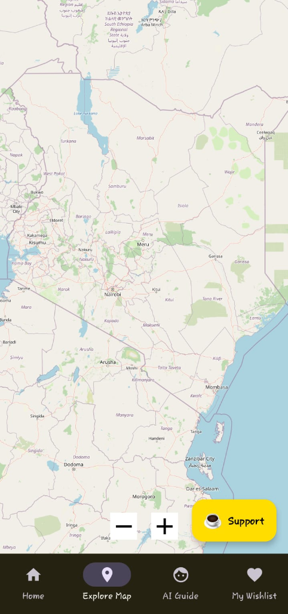

# 🇰🇪 Kenya Tourism - World Class Safari Companion 2026

<div align="center">


**Experience the Magic of Kenya - Powered by Gemini AI & Open Source Maps**

[](https://www.android.com/)
[](https://kotlinlang.org/)
[](https://developer.android.com/jetpack/compose)
[](https://deepmind.google/technologies/gemini/)
[](https://firebase.google.com/)

</div>

---

## 📱 App Preview

<p align="center">
  
  
  
  
</p>

## ✨ "World Class" Transformation

This application has been transformed from a basic tourism app into a **World-Class Commercial Platform**. It combines premium aesthetics with cutting-edge technology to offer a seamless experience for global travelers.

## 🌟 Key Features

### 🤖 Safari AI Guide (Stable AI Engine)
- **Real-time AI Assistant**: Powered by a stable OpenAI-compatible engine for global reliability.
- **Instant Access**: Works out-of-the-box for all users with zero configuration required.

### 🗺️ Fee-Free Global Mapping (OSM)
- **OpenStreetMap Integration**: Switched from Google Maps to **OSMDroid** to eliminate API billing.
- **Zero-Cost Scaling**: Perfect for millions of users without surprise fees.
- **Interactive Exploration**: High-performance markers and intuitive navigation across all 100+ destinations.

### 🌍 Global Community & Reviews
- **Firebase Firestore Sync**: User reviews and ratings sync instantly to a global real-time database.
- **Authentic Feedback**: Help fellow travelers discover the best spots with community-driven insights.

### 🎨 Ultra-Premium UI/UX
- **Refreshed Aesthetic**: High-contrast gradient overlays for crystal-clear readability on stunning safari photography.
- **Fluid Core**: 3D rotation animations, smooth transitions, and a savannah-inspired design system.
- **Modern Architecture**: Built with **Jetpack Compose** and **MVVM** for robust performance.

## 🛠️ Tech Stack

| Category | Technology |
|----------|------------|
| **Core** | Kotlin, Coroutines, Flow |
| **UI** | Jetpack Compose, Material 3 |
| **AI** | OpenAI-compatible Global Engine |
| **Maps** | OSMDroid (OpenStreetMap) |
| **Database** | Room (Offline Support), Firebase Firestore (Live Reviews) |
| **Analytics** | Firebase Analytics & Google Services |
| **Images** | Coil, Lottie |

## 🚀 Deployment & Build

### Package Name: `com.gideongeng.kenyatourism`

#### 🔧 Required Configuration
1.  **Firebase**: Ensure `google-services.json` is present in the `app/` directory.
2.  **API Key**: The Gemini API key is integrated in `MainActivity.kt`.

#### 📦 Build Commands
```bash
# Clean and Build Debug APK
./gradlew clean assembleDebug

# Build Production App Bundle (AAB)
./gradlew bundleDebug
```

## 📂 Project Structure

```
Kenyatourism/
├── app/
│   ├── src/
│   │   ├── main/
│   │   │   ├── kotlin/com/gideongeng/kenyatourism/
│   │   │   │   ├── ai/            # Gemini AI Logic
│   │   │   │   ├── data/          # Room & Firestore Repositories
│   │   │   │   ├── ui/            # Screens & Components
│   │   │   │   └── MainActivity.kt
│   │   │   ├── res/               # Premium Resources
│   │   │   └── AndroidManifest.xml
│   │   └── build.gradle.kts
│   └── google-services.json
└── build.gradle.kts
```

## 👨‍💻 Author

**Gideon Geny**
- GitHub: [@gideongeny](https://github.com/gideongeny)

---

<div align="center">

**Made with ❤️ for Kenya**

*Discover. Explore. Experience. Magically.*

</div>
