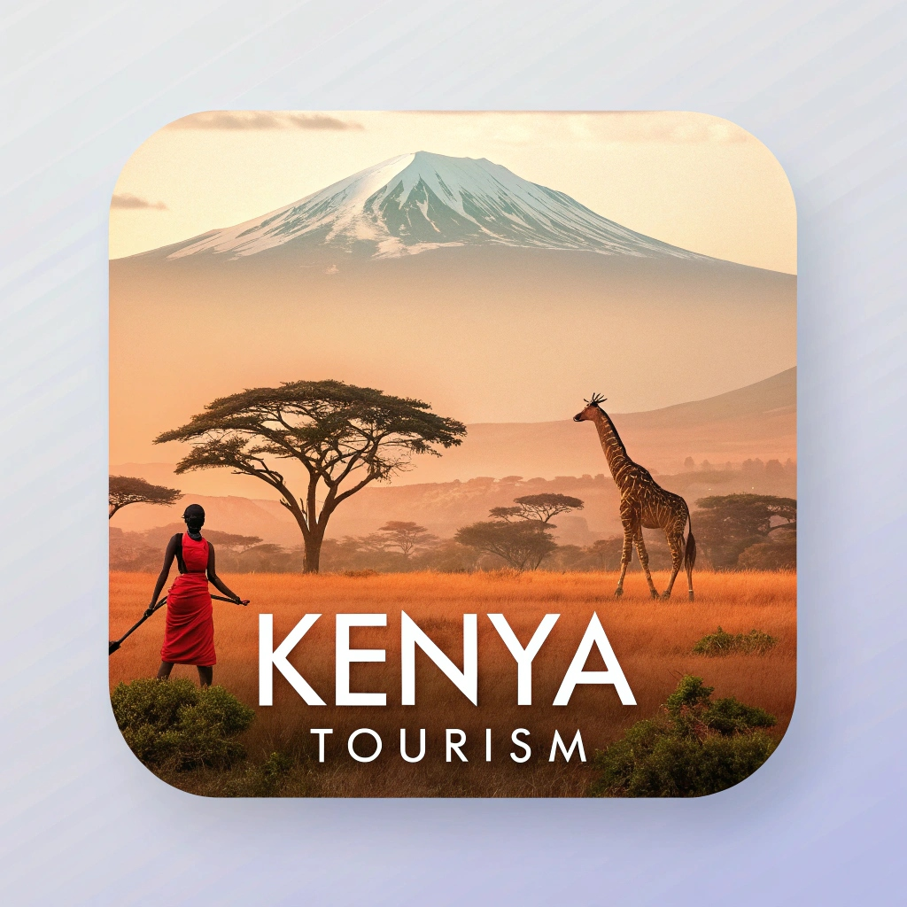
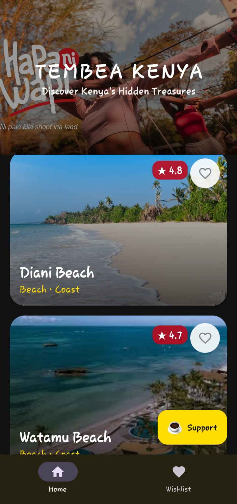
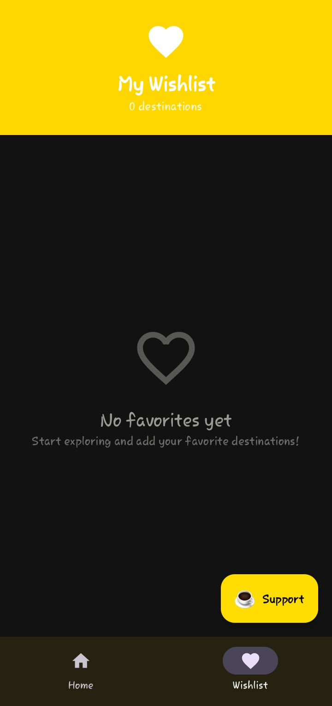

# 🇰🇪 Kenya Tourism - Magical Kenya 2026

**Discover the Magic of Kenya - Your Ultimate Tourism Companion**

## 📱 App Preview

  
  
  

## ✨ Overview

**Kenya Tourism** is a world-class Android application showcasing the breathtaking beauty and diverse attractions of Kenya. Built with modern Android development practices, this app features stunning 3D animations, a premium UI/UX design inspired by Kenyan heritage, and comprehensive information about 100+ tourist destinations across the country.

## 🌟 Features

### 🎨 Premium Design
- **Savannah-Inspired Color Palette**: Featuring Savannah Gold, Maasai Red, and Safari Green
- **3D Card Animations**: Smooth, interactive destination cards with rotation effects
- **Glassmorphism Effects**: Modern, premium visual aesthetics
- **Dark Mode Support**: Adaptive theming for optimal viewing

### 🗺️ Comprehensive Content
- **100+ Destinations**: Curated list of Kenya's finest attractions
- **Categories**: Safaris, Beaches, Cultural Sites, National Parks, and more
- **Detailed Information**: Rich descriptions, ratings, and regional data
- **High-Quality Images**: Stunning photography from Unsplash

### 💰 Monetization
- **Google AdMob Integration**
  - Banner Ads: Non-intrusive bottom placement
  - Interstitial Ads: Strategic placement between navigation
  - Rewarded Ads: Premium content unlocking

### 🚀 Technical Excellence
- **Jetpack Compose**: Modern declarative UI framework
- **Kotlin**: 100% Kotlin codebase
- **Material Design 3**: Latest design system implementation
- **Coil**: Efficient image loading
- **MVVM Architecture**: Clean, maintainable code structure

## 🛠️ Tech Stack

| Technology | Purpose |
|------------|---------|
| Kotlin | Primary programming language |
| Jetpack Compose | Modern UI toolkit |
| Material Design 3 | Design system |
| Coil | Image loading library |
| Google Mobile Ads SDK | Monetization |
| Gradle 8.5 | Build system |
| Android Gradle Plugin 8.1.0 | Android build configuration |

## 📋 Prerequisites

- Android Studio Iguana (2023.2.1) or newer
- JDK 11 or higher
- Android SDK 34 (compileSdk)
- Minimum SDK 24 (Android 7.0)

## 🚀 Getting Started

### Clone the Repository

\`\`\`bash
git clone https://github.com/gideongeny/Kenyatourism.git
cd Kenyatourism
\`\`\`

### Open in Android Studio

1. Launch Android Studio
2. Select **File > Open**
3. Navigate to the cloned repository
4. Click **OK** and wait for Gradle sync

### Build the Project

\`\`\`bash
# Debug APK
./gradlew assembleDebug

# Release APK
./gradlew assembleRelease

# Android App Bundle (AAB)
./gradlew bundleDebug
\`\`\`

### Run on Device/Emulator

1. Connect your Android device or start an emulator
2. Click the **Run** button in Android Studio
3. Select your target device

## 🔧 Configuration

### AdMob Setup

The app is pre-configured with AdMob IDs. To use your own:

1. Open `app/src/main/AndroidManifest.xml`
2. Replace the AdMob App ID:
   \`\`\`xml
   <meta-data
       android:name="com.google.android.gms.ads.APPLICATION_ID"
       android:value="YOUR_ADMOB_APP_ID"/>
   \`\`\`

3. Update ad unit IDs in `AdsManager.kt`:
   \`\`\`kotlin
   private const val BANNER_ID = "YOUR_BANNER_ID"
   private const val INTERSTITIAL_ID = "YOUR_INTERSTITIAL_ID"
   private const val REWARDED_ID = "YOUR_REWARDED_ID"
   \`\`\`

## 📦 Project Structure

\`\`\`
Kenyatourism/
├── app/
│   ├── src/
│   │   ├── main/
│   │   │   ├── kotlin/com/kenyatourism/app/
│   │   │   │   ├── ads/           # AdMob integration
│   │   │   │   ├── data/          # Data models & repository
│   │   │   │   ├── ui/theme/      # Design system
│   │   │   │   └── MainActivity.kt
│   │   │   ├── res/
│   │   │   │   ├── drawable/      # Vector graphics
│   │   │   │   ├── mipmap/        # App icons
│   │   │   │   ├── values/        # Themes, colors, strings
│   │   │   │   └── xml/           # Backup rules
│   │   │   └── AndroidManifest.xml
│   │   └── build.gradle.kts
│   └── build.gradle.kts
├── gradle/
├── build.gradle.kts
└── settings.gradle.kts
\`\`\`

## 🎯 Key Components

### MainActivity
The main entry point featuring:
- Jetpack Compose UI
- 3D card animations with `graphicsLayer`
- AdMob integration
- Destination listing with LazyColumn

### DestinationsRepository
Comprehensive data source with 100+ Kenyan destinations including:
- Maasai Mara National Reserve
- Diani Beach
- Mount Kenya
- Lamu Old Town
- And many more...

### AdsManager
Centralized ad management for:
- Banner ad loading and display
- Interstitial ad preloading
- Rewarded ad implementation

## 🌈 Design System

### Color Palette
- **Savannah Gold**: `#FFD700` - Primary accent
- **Maasai Red**: `#BB0A1E` - Tertiary accent
- **Safari Green**: `#06402B` - Secondary accent
- **Obsidian Black**: `#121212` - Dark mode background
- **Ivory White**: `#F5F5F0` - Light mode background

### Typography
- **Display Large**: 32sp, Bold - Headers
- **Headline Medium**: 24sp, SemiBold - Section titles
- **Body Large**: 16sp, Normal - Content text

## 📄 License

This project is licensed under the MIT License - see the [LICENSE](LICENSE) file for details.

## 👨‍💻 Author

**Gideon Geny**
- GitHub: [@gideongeny](https://github.com/gideongeny)

## 🙏 Acknowledgments

- **Unsplash**: High-quality destination images
- **Google Mobile Ads**: Monetization platform
- **Jetpack Compose**: Modern UI framework
- **Kenya Tourism Board**: Inspiration and content

## 📞 Support

For issues, questions, or contributions:
- Open an issue on [GitHub Issues](https://github.com/gideongeny/Kenyatourism/issues)
- Submit a pull request

## 🗺️ Roadmap

- [ ] Offline mode support
- [ ] Booking integration
- [ ] User reviews and ratings
- [ ] Interactive maps
- [ ] Multi-language support
- [ ] Social media sharing

---

**Made with ❤️ for Kenya**

*Discover. Explore. Experience.*

